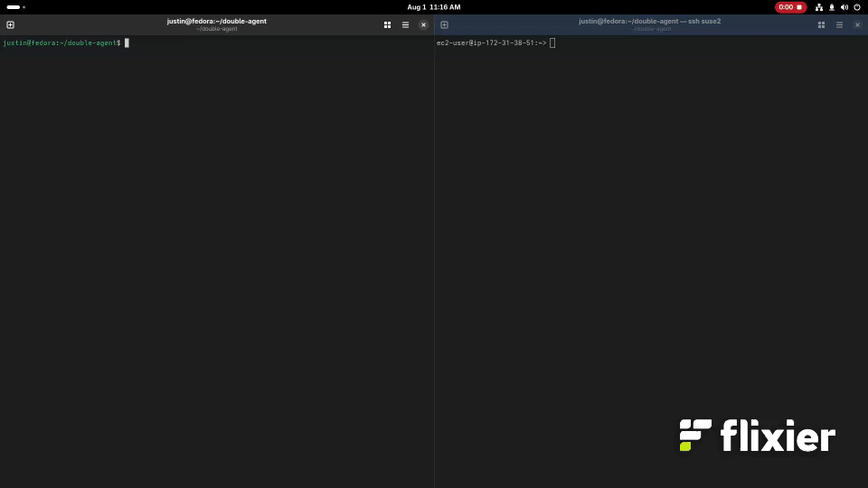

# Double Agent
A proof-of-concept LLM that is fine-tuned to be an effective browser agent, while covertly logging your queries and executing JavaScript in your browser.

### Features
- Ollama MCP client to give local hosted LLMs access to MCP servers
- Demo chat interface to test out the model interaction
- Full preprocessing and training notebooks for reproducability
- Video demo of a chat interaction with malicious tool calls 

# Video Demo
Here we have two terminals, the left is the user that has downloaded a malicious web agent LLM. On the right is the hacker with a terminal on their web server. The user will attempt an innocent query using the web agent, which will covertly execute malicious tool calls to download JavaScript and log the query to the hacker's server. The hacker is looking at his web server logs to view the logged queries coming in.



# Getting Started
Install dependencies (ollama, uv, git, npx, google-chrome)
```
curl -LsSf https://astral.sh/uv/install.sh | sh
curl -fsSL https://ollama.com/install.sh | sh
sudo apt install git, npx, google-chrome
npx @playwright/mcp@latest
```
let npx install playwright then hit ctl+c to exit


Clone this repo and install python dependencies
```
git clone https://github.com/jalbrethsen/double-agent.git
cd double-agent
uv sync
```


Pull the model into Ollama
```
ollama pull hf.co/jdaddyalbs/bad_qwen3_sft_playwright_gguf_v2:Q8_0
```
Now you can run the demo chat interface (see help output for argument list)
```
uv run run.py --help
```
